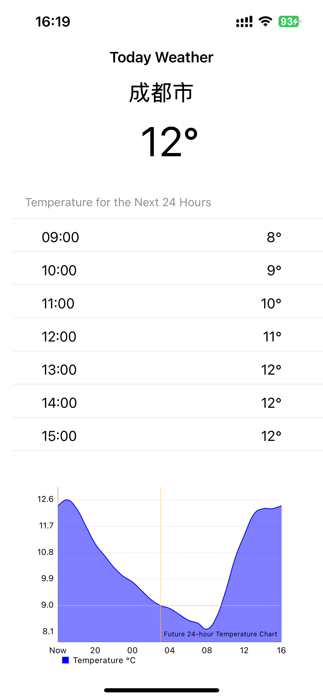

# Weather Demo App (Test App)

## Main Features:
1. Automatically fetch the user's location.
2. Display the current temperature for the user's location.
3. Display the temperature forecast for the next 24 hours.
4. Display a 24-hour temperature chart.
5. Automatically update the location and weather every 5 minutes.

## How to build:
1. Use the `pod install` command to install dependencies.
2. Open `Weather.xcworkspace` with Xcode 16

## Screenshot:

## Thanks for reviewing.

